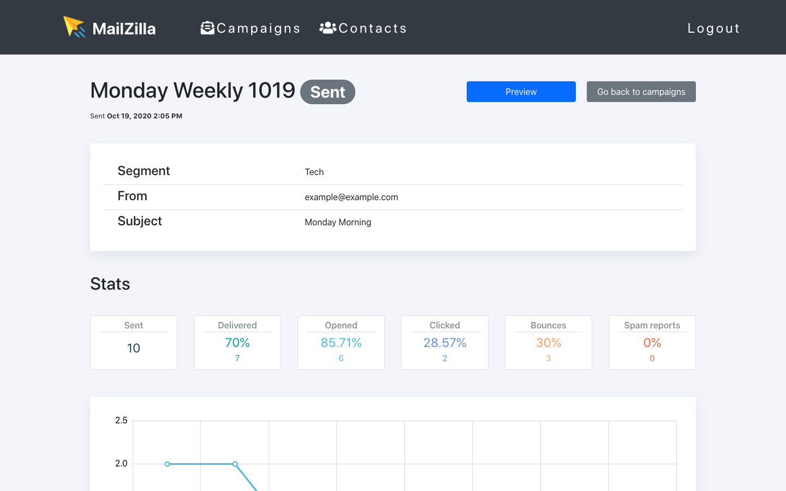

# MailZilla 📩



Email newsletter tool built with React and Ruby on Rails.

**[Live Demo](https://mailzilla.vercel.app/)**

---

## Features

- Send email campaigns via SendGrid
- Track campaign stats: open rate, click rate, bounces, spam reports, unsubscribes
- Import contacts from spreadsheets
- Manage and segment contacts
- Rich HTML template editor (CKEditor)
- Data visualization dashboards (amCharts)

## Tech Stack

| Layer | Technology |
|---|---|
| Frontend | React 16, Redux, Reactstrap, Bootstrap 4 |
| Backend | Ruby 3.3, Rails 7, Puma |
| Database | PostgreSQL |
| Email | SendGrid |
| Template Editor | CKEditor 4 |
| Charts | amCharts 4 |
| Deploy | Render |

## Local Setup

### Prerequisites

- Ruby 3.3.x
- Node.js + npm
- PostgreSQL

### Backend

```bash
bundle install
rails db:create db:migrate db:seed
rails s
```

API runs on `http://localhost:3000`.

### Frontend

```bash
cd client
npm install
npm start
```

App runs on `http://localhost:3001`.

### Demo Account

Seeded automatically via `db:seed`:

```
Email:    demo@mailzilla.com
Password: demo1234
```

## API Endpoints

```
POST   /api/v1/users              # register
POST   /api/v1/login              # login
GET    /api/v1/profile            # current user

GET    /api/v1/contacts           # list contacts
POST   /api/v1/contacts           # create contact
PATCH  /api/v1/contacts/:id/add_segment
PATCH  /api/v1/contacts/:id/remove_segment

GET    /api/v1/segments           # list segments

GET    /api/v1/campaigns          # list campaigns
GET    /api/v1/campaigns/templates
POST   /api/v1/campaigns/:id/send_test
POST   /api/v1/campaigns/:id/send_to_segment
POST   /api/v1/campaigns/:id/upload
GET    /api/v1/campaigns/:id/stats

POST   /api/v1/webhooks           # SendGrid event webhook
```

## Environment Variables

| Variable | Description |
|---|---|
| `DATABASE_URL` | PostgreSQL connection string |
| `SENDGRID_API_KEY` | SendGrid API key |
| `SECRET_KEY_BASE` | Rails secret key |
| `RAILS_MASTER_KEY` | Rails credentials master key |

## Deployment

Configured for [Render](https://render.com) via `render.yaml`. Deploys Rails API as a web service with a managed PostgreSQL database.
